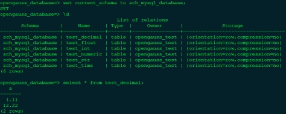
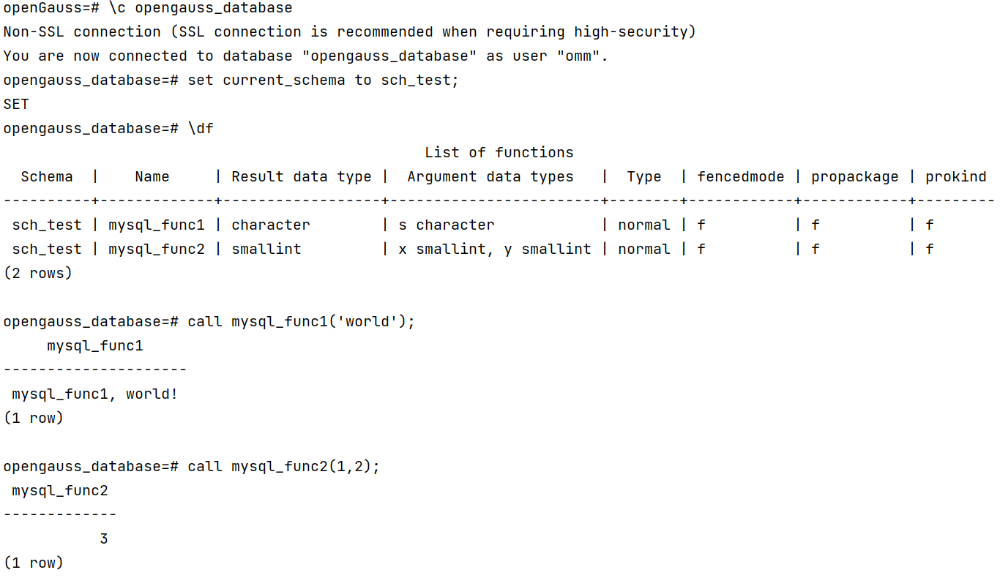
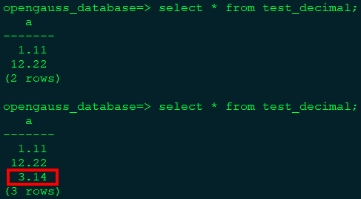

目录

[Toc]

# **1.** 概述

## **1.1.** 目的

本文旨在指导如何安装、使用chameleon工具完成从MySQL数据库迁移到openGauss。

## **1.2.** chameleon介绍

chameleon是一个用Python 3编写的MySQL到openGauss的实时复制工具。工具使用mysql-replication库从MySQL中提取row images，这些row images将以jsonb格式被存储到openGauss中。在openGauss中会执行一个pl/pgsql函数，解码jsonb并将更改重演到openGauss。同时，工具通过一次初始化配置，使用只读模式，将MySQL的全量数据拉取到openGauss，使得该工具提供了初始全量数据的复制以及后续增量数据的实时在线复制功能。

## **1.3.** 注意事项

### 1.3.1. 一般性限制

- 根据mysql-replication的要求，Python 3仅支持3.5~3.7。
- MySQL列的AUTO_INCREMENT属性，在openGauss侧将通过序列(serial)实现。
- detach复制副本进程将重置openGauss中的序列(serial)，以使数据库独立工作。外键约束也会在detach过程中被创建和验证。
- 视图、自定义函数、存储过程、触发器支持离线迁移，不支持在线迁移。
- 自定义type不支持离线和在线迁移。
- 对于分区表，openGauss无法支持的分区表类型暂不会被迁移。分区表迁移规则见[分区表迁移规则](#_分区表迁移规则)。
- 配置文件中，schema mappings中指定的openGauss侧的目的schema名称不能是sch_chameleon。sch_chameleon是工具将自行创建用于辅助复制的schema名称。
- 列默认值问题。由于列的默认值可以是表达式，部分MySQL的表达式若openGauss不支持的话，离线迁移过程中会报错，导致迁移失败。可通过关闭迁移默认值的方式临时规避该问题。
- MySQL的unsigned数据类型迁移时，会自动去掉unsigned属性，如MySQL的unsigned int迁移到openGauss时将变成 int，若MySQL中存储的数据超过了int的取值范围，迁移过程中会出错。
- 工具支持的MySQL版本为 5.5+，openGauss的版本为 2.1.0+。
- 对于float、double等浮点数，迁移过程中可能由于精度误差，造成MySQL和openGauss中的值不完全一样。
- 若想迁移到openGauss的表名和视图名的大小写与MySQL一致，MySQL的系统变量lower_case_table_names的值应设置为0。存在大小写的触发器名、自定义函数名、存储过程名迁移前后一致。
- 对于索引或约束中的表达式，如索引前缀表达式id(5)的写法目前暂会迁移为col_name。
- 迁移后的索引或者约束如index_name会改写为tbl_name_index_name的带有表名前缀的格式。
- 由于openGauss内核中哈希分区表不支持切割分区，不支持合成分区，不支持添加和删除分区。列表分区表不支持切割分区，不支持合成分区，故该工具在HASH/LIST分区暂不支持COALESCE和REORGANIZE，在HASH分区不支持ADD/DROP PARTITION。
- 由于目前openGauss内核的限制，二级分区的分区表可以正常执行 ALTER PARTITION中的ADD/DROP/TRUNCATE功能，COALESCE/REORGANIZE/EXCHANGE暂不支持。
- 对于HASH分区及KEY分区表在线迁移，由于MySQL和openGauss中hash分区内核实现不同，迁移后openGauss数据存放分区与MySQL中数据存放的分区存在差异。
- 对于二级分区表，openGauss不支持一级和二级分区采用相同的键值。

### 1.3.2. 对象迁移限制

- chameleon支持复制数据库对象是基于[openGauss-tools-sql-translator](https://gitee.com/opengauss/openGauss-tools-sql-translator)仓库进行数据库对象的翻译，可前往该仓库了解数据库对象的翻译情况。
- 目前，要迁移的数据库对象体内若存在commit或rollback无法解析翻译，将迁移失败。
- 目前MySQL存储过程中的NO SQL、READS SQL DATA、MODIFIES SQL字段和自定义函数中的CONTAINS SQL、NO SQL、READS SQL DATA、MODIFIES SQL DATA、SECURITY字段无法解析，无法将这些openGauss不支持的参数屏蔽且warning提示信息。而是直接报错，迁移失败。

### 1.3.3. 在线迁移限制

在线DDL仅支持部分语句，主要包括 CREATE/DROP/RENAME/TRUNCATE TABLE, ALTER TABLE DROP/ADD/CHANGE/MODIFY, DROP PRIMARY KEY, CREATE/DROP INDEX, ALTER TABLE ADD FOREIGN KEY/UNIQUE INDEX/INDEX, ALTER TABLE DROP FOREIGN KEY/INDEX/CONSTRAINT, ALTER TABLE ADD/DROP/TRUNCATE/COALESCE/EXCHANGE/REORGANIZE PARTITION。

#### **1.3.3.1.** 添加/删除字段

ALTER TABLE {table_name} ADD/DROP

#### **1.3.3.2.** 修改字段数据类型、名称

ALTER TABLE {table_name} CHANGE/MODIFY

#### **1.3.3.3.** 删除主键约束

ALTER TABLE {table_name} DROP PRIMARY KEY

#### **1.3.3.4.** 删除表

DROP TABLE

#### **1.3.3.5.** 重命名表

RENAME TABLE

#### **1.3.3.6.** 截断表

TRUNCATE TABLE

#### **1.3.3.7.** 创建表

CREATE TABLE

#### **1.3.3.8.** 在线创建索引

1.CREATE [UNIQUE] INDEX index_name [index_type] ON tbl_name (key_part,...) [index_option]

2.ALTER TABLE  ADD {INDEX | KEY} [index_name] [index_type] (key_part,...) [index_option] 

index_type: USING {BTREE | HASH}
key_part: {col_name [(length)] | (expr)} [ASC | DESC]
index_option: {index_type | COMMENT 'string'}

#### **1.3.3.9.** 在线删除索引

1.DROP INDEX index_name ON tbl_name

2.ALTER TABLE tbl_name DROP {INDEX | KEY} index_name

#### **1.3.3.10.** 在线创建外键

ALTER TABLE tbl_name ADD [CONSTRAINT [symbol]] FOREIGN KEY [index_name] (col_name,...) reference_definition

#### **1.3.3.11.** 在线删除外键

ALTER TABLE tbl_name DROP FOREIGN KEY fk_symbol

#### **1.3.3.12.** 在线创建唯一约束

ALTER TABLE tbl_name ADD [CONSTRAINT [symbol]] UNIQUE [INDEX | KEY] [index_name] [index_type] (key_part,...) [index_option] ...

#### **1.3.3.13.** 在线删除唯一约束

ALTER TABLE tbl_name DROP {CHECK | CONSTRAINT} symbol

#### **1.3.3.14.** 在线创建分区表

CREATE TABLE tbl_name [(create_definition,...)] [table_options] [partition_options]

#### **1.3.3.15.** 在线 alter 分区表 ADD PARTITION

ALTER TABLE tbl_name ADD PARTITION (partition_definition)

#### **1.3.3.16.** 在线 alter 分区表 DROP PARTITION

ALTER TABLE tbl_name DROP PARTITION partition_names

#### **1.3.3.17.** 在线 alter 分区表 TRUNCATE PARTITION

ALTER TABLE tbl_name TRUNCATE PARTITION {partition_names | ALL}

#### **1.3.3.18.** 在线 alter 分区表 COALESCE PARTITION

ALTER TABLE tbl_name COALESCE PARTITION number

#### **1.3.3.19.** 在线 alter 分区表 EXCHANGE PARTITION

ALTER TABLE tbl_name EXCHANGE PARTITION partition_name WITH TABLE tbl_name [{WITH | WITHOUT} VALIDATION]

#### **1.3.3.20.** 在线 alter 分区表 REORGANIZE PARTITION

ALTER TABLE tbl_name REORGANIZE PARTITION partition_names INTO (partition_definitions)

# **2.** chameleon安装方法

可直接下载whl安装包或者通过源码安装。

## **2.1.** whl安装

安装包下载地址：

https://opengauss.obs.cn-south-1.myhuaweicloud.com/latest/chameleon/chameleon-1.0.0-py3-none-any.whl

下载完成后，通过python virtual env环境进行安装，首先创建python虚拟环境并激活：

**python3 -m venv venv**

**source venv/bin/activate**

然后通过pip安装即可：

**pip3 install ./chameleon-1.0.0-py3-none-any.whl**

注意：安装过程中，将自动安装该工具依赖的其他库，请确保本机的pip能正常下载安装相关依赖。相关依赖库及版本要求为：

**PyMySQL>=0.10.0, <1.0.0**

**argparse>=1.2.1**

**mysql-replication>=0.22**

**py-opengauss>=1.3.1**

**PyYAML>=5.1.2**

**tabulate>=0.8.1**

**daemonize>=2.4.7**

**rollbar>=0.13.17**

**geomet>=0.3.0**

**mysqlclient>=2.1.1**

注意：mysqlclient的安装需要先使用yum安装mysql-devel，直接使用yum install mysql-devel即可。

## **2.2.** 源码安装

通过git下载源码： **git clone git@gitee.com:opengauss/openGauss-tools-chameleon.git**

下载完成后，同样需要先创建python虚拟环境并激活：

**python3 -m venv venv**

**source venv/bin/activate**

然后进入代码的目录，执行python install命令安装：

**cd openGauss-tools-chameleon**

**python3 setup.py install**

 

安装完成后，不要退出python虚拟环境，可以开始使用chameleon工具。

# **3.** chameleon配置文件说明

完整的配置文件如下所示：

```
# global settings

pid_dir: '~/.pg_chameleon/pid/'

log_dir: '~/.pg_chameleon/logs/'

log_dest: file

log_level: info

log_days_keep: 10

rollbar_key: ''

rollbar_env: ''

 

type_override:

  "tinyint(1)":

     override_to: boolean

     override_tables:

       \- "*"

  "float(5,2)":

     override_to: float4

     override_tables:

       \- "*"

 

\# postgres destination connection

pg_conn:

  host: "localhost"

  port: "5432"

  user: "usr_test"

  password: "test"

  database: "db_test"

  charset: "utf8"

 

sources:

mysql:

     readers: 4

     writers: 4

     db_conn:

       host: "localhost"

       port: "3306"

       user: "usr_test"

       password: "test"

       charset: 'utf8'

       connect_timeout: 10

     schema_mappings:

       sakila: my_sakila

     limit_tables:

     skip_tables:

     grant_select_to:

     lock_timeout: "120s"

     my_server_id: 100

     replica_batch_size: 10000

     replay_max_rows: 10000

     batch_retention: '1 day'

     copy_max_memory: "300M"

     copy_mode: 'file'

     out_dir: /tmp

     sleep_loop: 1

     type: mysql

     keep_existing_schema: No

     migrate_default_value: Yes
```

配置文件使用yaml文件规则配置，需要特别注意对齐，缩进表示层级关系，缩进时不允许使用Tab键，只允许使用空格，缩进的空格数目不重要，但相同层级的元素左侧需要对齐。

## **3.1.** 全局设置

### 3.1.1. pid_dir

进程pid存储的路径。init_replica和start_replica阶段，如果工具在后台运行，进程的pid将保存在该文件夹下。

### 3.1.2. log_dir

进程运行过程中，log存储的路径。

### 3.1.3. log_dest

log打印的目标。stdout表示将log信息输出到屏幕, file 表示将log信息输出到文件，文件的位置由log_dir决定。

### 3.1.4. log_level

log等级。有效值为 debug, info, warning, error, critical.

### 3.1.5. log_days_keep

log文件保留时间，单位为天。

### 3.1.6. rollbar_key

可选项。工具可配合rollbar(https://rollbar.com/)联合使用。如果在rollbar官网注册了账号，可将对应账号的POST_SERVER_ITEM_ACCESS_TOKEN填入rollbar_key。

### 3.1.7. rollbar_env

可选项。用于表示rollbar环境，与rollbar_key配合使用。若同时配置了 rollbar_key 和 rollbar_env，工具执行阶段的部分消息将被发送到 rollbar，可在rollbar官网登录自己的账号后看到相关消息。

## **3.2.** 类型重载规则

type_override，允许用户覆盖默认类型转换为自定义的类型转换。每个类型键的命名应与要覆盖的MySQL类型完全相同，包括大小规模。配置后，与所配置数据类型相关的任何操作，重载的类型映射都会生效，包括离线、在线创建表中的列包含对应数据类型、在线执行alter table add/change/modify列包含对应数据类型时均会生效。 每个类型键需要两个子键override_to和override_tables。

示例：

```
type_override:

  "tinyint(1)":

     override_to: boolean

     override_tables:

       \- "*"

  "float(5,2)":

     override_to: float4

     override_tables:

       \- schema.table
```


### 3.2.1. override_to

指定目标类型，该类型必须是openGauss支持的类型，并且类型转换应该是可行的。

### 3.2.2. override_tables

一个yaml列表，它指定覆盖应用于哪些表。如果第一个列表项设置为“*”，则覆盖将应用于schema中的所有表。如果表名称与override_tables值匹配，则覆盖也会应用于每个匹配的DDL（创建表/变更表）。

## **3.3.** openGauss连接配置

pg_conn配置部分，用于配置openGauss连接选项。

### 3.3.1. host

openGauss所在机器的IP或者hostname。

### 3.3.2. port

openGauss server监听的端口号。

### 3.3.3. user

连接openGauss时使用的用户名。该用户需要对数据库有创建schema、创建表的权限。

### 3.3.4. password

用户名对应的密码。

### 3.3.5. database

需要将MySQL的数据迁移到的目的数据库名称。

### 3.3.6. charset

database所指定的数据库的编码格式。

## **3.4.** MySQL配置

sources配置源数据库，主要是MySQL的连接配置及复制过程中用到的参数配置。

### 3.4.1. db_conn

MySQL连接选项。

#### **3.4.1.1.** host

MySQL所在机器的IP或者hostname。

#### **3.4.1.2.** port

MySQL server监听的端口号。

#### **3.4.1.3.** user

连接MySQL时使用的用户名。该用户至少需要对数据库有读取、REPLICATION CLIENT、REPLICATION SLAVE、RELOAD的权限。

#### **3.4.1.4.** password

用户名对应的密码。

#### **3.4.1.5.** database

需要迁移的MySQL数据库名称。

#### **3.4.1.6.** charset

database所指定的数据库的编码格式。

### 3.4.2. connect_timeout

连接MySQL时的超时时间。较大的值可以帮助工具在慢速网络中更好地工作。低值可能会导致连接在执行任何操作之前失败。

### 3.4.3. schema_mappings

​    schema_mappings:

​     my_sakila: pgsql_sakila

schema mappings是一个字典。每个键都是一个需要在openGauss中被复制的MySQL数据库。在示例中提供了MySQL数据库my_sakila被复制到schema pgsql_sakila，存储在pg_conn（db_test）中指定的数据库中。

### 3.4.4. limit_tables

包含要复制的表。如果列表为空，则复制整个MySQL数据库。注意如果通过在线DDL更改了表名，limit_tables并不会一同更新。比如配置limit_tables为 my_sakila.test_table，然后在线复制阶段，在MySQL侧通过**alter table test_table rename to test_table_rename**; 那么后续对于test_table_rename的DML操作无法被同步。因为limit_tables记录的仍是rename之前的test_table，无法识别该表已经被rename成了test_table_rename。

### 3.4.5. skip_tables

包含不被复制的表。同limit_tables一样，如果通过在线DDL更改了表名，skip_tables并不会一同更新。

### 3.4.6. grant_select_to

在openGauss侧给指定的角色赋予对复制过来的表 select 权限。如果keep_existing_schema配置项设置为Yes，grant_select_to将不起作用。

### 3.4.7. lock_timeout

目前该配置项无任何作用。

### 3.4.8. my_server_id

MySQL副本的服务器ID，需要与MySQL服务器配置的server_id保持一致。

### 3.4.9. replica_batch_size

指在对openGauss数据库执行写入之前，从MySQL副本中提取的最大行数。如果为负数，效果相当于0或1，即每从mysql副本中提取1行，就立即向openGauss执行写入。该参数主要影响大量数据待写入openGauss时的性能，比如从mysql副本中提取了1W行数据，如果replica_batch_size <= 1，那么这 1W 行数据将分成1W次 copy写入openGauss，每次copy写入一条。如果replica_batch_size >= 1W，那么这 1W 行数据将一次性通过1次 copy 批量写入。

### 3.4.10. batch_retention

指 t_replica_batch中重演批处理行的最大保留时间。该数值 <= 0意味着当该批次被重演过之后将即刻被删除，不会被保留。

### 3.4.11. copy_max_memory

在openGauss中复制表时要使用的最大内存量。可以指定以KB、MB、GB为单位的值，添加后缀（例如300M）。

### 3.4.12. copy_mode

有效值为“file”和“direct”。“direct”会让复制实时进行。对于“file”，表首先转储到csv文件中，然后在openGauss中重新加载，加载完成后csv文件会被删除。csv文件存储的位置由out_dir配置。

### 3.4.13. out_dir

如果copy_mode为file，则在init_replica过程中转储csv文件的目录。

### 3.4.14. sleep_loop

两个副本批次之间的睡眠循环秒数。单位为秒。间隔N秒之后从MySQL读取下一批次数据。

### 3.4.15. on_error_replay

指在 start_replica 阶段，openGauss侧重演失败时的动作。’exit’表示在openGauss侧重演失败时，退出复制进程。’continue’表示在openGauss侧重演失败时，从复制副本中删除失败的表，后续对于该表的改动不会再同步，同时继续其他表的复制。

### 3.4.16. on_error_read

指在start_replica 阶段，连接MySQL失败时的动作。’exit’表示连接MySQL失败则退出进程。’continue’表示连接MySQL失败则一直重试。

### 3.4.17. auto_maintenance

指定触发自动维护（vaccum）后的超时时间。参数接受对openGauss间隔数据类型(例如1 day)，如果设置为disabled自动维护不会运行。如果省略该参数，则默认值为disabled。

### 3.4.18. gtid_enable

beta参数，默认设置为false。暂时不要启用。

### 3.4.19. type

指定源数据库类型。系统支持mysql或pgsql。其中pgsql是实验特性，暂时不建议使用。

### 3.4.20. skip_events

skip_events变量告诉chameleon跳过表或整个schema的特定事件。

#### **3.4.20.1.** insert

在线复制阶段，对于指定的表或schema，跳过insert事件。

#### **3.4.20.2.** delete

在线复制阶段，对于指定的表或schema，跳过delete事件。

#### **3.4.20.3.** update

在线复制阶段，对于指定的表或schema，跳过update事件。

### 3.4.21. keep_existing_schema

当设置为Yes时，init_replica时不会使用MySQL源中的数据重新创建受影响的表。相反，现有表将被截断并重新加载数据。执行REINDEX表，以便在重新加载后使索引处于良好状态。这要求被复制的表已经在openGauss侧存在。

当设置为No时，init_replica时会先删除openGauss测待复制的schema并重新创建。

### 3.4.22. readers

用于指定离线迁移过程中读线程的数目。

### 3.4.23. writers

用于指定离线迁移过程中写线程的数目。

### 3.4.24. migrate_default_value

是否迁移MySQL的默认值到openGauss。默认为Yes。由于列的默认值可以是表达式，部分MySQL的表达式若openGauss不支持的话，离线迁移过程中会报错，导致迁移失败。可通过将本值设置为No临时规避此类问题。

# **4.** 分区表迁移规则

分区表迁移的基本思想是对于openGauss支持的分区类型，迁移成对应的分区表即可。对于openGauss支持的分区表类型详见以下表格，其中不支持的分区表将暂不迁移。

| 类别        | 说明                                                         | MySQL                                                        | openGauss                                                    | 迁移规则                                                     |
| ----------- | ------------------------------------------------------------ | ------------------------------------------------------------ | ------------------------------------------------------------ | ------------------------------------------------------------ |
| range分区   | 基于一个给定连续区间范围，把数据分配到不同的分区             | 1. range分区要求分区键必须是int型。或者通过表达式返回 int 类型。 2. 若分区表中有主键/唯一建，则主键/唯一建必须包含分区键。 3. 仅支持 value less than方式 | value less than语法：支持4列分区键，支持整数、浮点数、字符串、时间做分区键。 Start end语法：支持1列分区键。支持整数、浮点数、时间做分区键。 Interval语法：支持1列分区键。支持时间做分区键 | openGauss可完全兼容MySQL。所有MySQL的range分区表均可迁移到openGauss的range分区表。 |
| list分区    | 类似 range 分区，区别在 list 分区是基于枚举出的值列表分区，range 是基于给定的连续区间范围分区 | 1. range分区要求分区键必须是int型。或者通过表达式返回 int 类型。 2. 若分区表中有主键/唯一建，则主键/唯一建必须包含分区键。 | 1. 支持1列分区键。 2. 支持整数、字符串、时间做分区键。       | openGauss可完全兼容MySQL。所有MySQL的list分区表均可迁移到openGauss的list分区表。 |
| hash分区    | 基于给定的分区个数，把数据分配到不同的分区                   | 1. range分区要求分区键必须是int型。或者通过表达式返回 int 类型。 2. 若分区表中有主键/唯一建，则主键/唯一建必须包含分区键。 3. 支持linear关键字，常规 hash 使用的是取模算法，线性 hash 使用的是一个线性的 2 的幂的运算法则 | 1. 支持1列分区键。 2. 支持整数、字符串、时间做分区键。       | openGauss不支持linear关键字，仅支持普通hash表。不过可以忽略，linear影响的主要是hash分布，以及对hash分区增减时减少数据重分布的影响。所以对于linear hash分区表，将迁移成普通的hash表。 |
| key分区     | 类似于 hash 分区                                             | 1. blob 或 text 列类型除外可做分区键 2. 若分区表中有主键/唯一建，则主键/唯一建必须包含分区键。 3. 支持linear关键字，常规 hash 使用的是取模算法，线性 hash 使用的是一个线性的 2 的幂的运算法则 4. 不能使用表达式作为分区键 5. 可使用多个列做分区键 | 无对应类型，不过基本可以使用hash分区表替代。                 | 1. 当只用一列做分区键且分区键类型是整数、字符串、时间时，可用hash分区替代。多列分区键不支持，其他数据类型不支持。对于不支持的分区表，将迁移成普通表。 2.不支持linear关键字，没有类似的处理。不过可以忽略，linear影响的主要是hash分布，以及对hash分区增减时减少数据重分布的影响。所以对于linear key分区表，将迁移成普通的hash表。 |
| columns分区 | 是range分区和list分区的扩展，分为range columns 分区和 list columns 分区 | 1. 支持整数，日期时间数据类型做分区键。 2. 可使用多个列做分区键 3. 若分区表中有主键/唯一建，则主键/唯一建必须包含分区键。 | 无对应类型，部分可用range或list分区替代。                    | 1.range columns分区，支持不超过4列。2.list columns分区，不支持多列分区键。 |
| 二级分区    | 在 MySQL 5.7 中，可以对被RANGE或LIST分区的 table 进行子分区。子分区可以使用HASH或KEY分区。                                   | 在SUBPARTITION子句全部使用显式定义子分区，以指定各个子分区的选项，每个分区必须具有相同数量的子分区，每个SUBPARTITION子句必须(至少)包括该子分区的名称。   | 转化成RANGE/LIST分区，HASH子分区进行替代       | RANGE/LIST/HASH规则同上述对应分区规则 |

|  | Range分区 | List分区 | Hash/Key分区 | 二级分区 |
| ---------- | ----- | ----- | ----- | ----- |
| ADD PARTITION | MySQL ✓，openGauss ✓ | MySQL ✓，openGauss ✓ | MySQL ✓，openGauss × | MySQL ✓，openGauss ✓ |
| DROP PARTITION | MySQL ✓，openGauss ✓ | MySQL ✓，openGauss ✓ | MySQL ✓，openGauss × | MySQL ✓，openGauss ✓ |
| TRUNCATE PARTITION | MySQL ✓，openGauss ✓ | MySQL ✓，openGauss ✓ | MySQL ✓，openGauss ✓ | MySQL ✓，openGauss ✓ |
| COALESCE PARTITION | MySQL ×，openGauss × | MySQL ×，openGauss × | MySQL ✓，openGauss × | MySQL ×，openGauss × |
| EXCHANGE PARTITION | MySQL ✓，openGauss ✓ | MySQL ✓，openGauss ✓ | MySQL ✓，openGauss ✓ | MySQL ✓，openGauss × |
| REORGANIZE PARTITION | MySQL ✓，openGauss ✓ | MySQL ✓，openGauss × | MySQL ✓，openGauss × | MySQL ✓，openGauss × |

备注：
ADD/DROP PARTITION 中，openGauss内核中hash分区不支持添加和删除分区，故hash分区不支持。

TRUNCATE PARTITION 中，openGauss内核中hash分区数据与MySQL存放分区数据不一致，故hash分区支持但数据不一致。

COALESCE PARTITION 中，MySQL中COALESCE PARTITION can only be used on HASH/KEY partitions，RANGE/LIST分区不支持该操作，openGauss无对应操作，故仅hash分区能使用COALESCE操作。由于openGauss内核中list和hash分区不支持切割和合成分区，故hash分区不支持。

EXCHANGE PARTITION 中，openGauss内核中hash分区数据与MySQL存放分区数据不一致，故hash分区支持但数据不一致。openGauss内核中二级分区暂不支持EXCHANGE操作，故二级分区不支持

REORGANIZE PARTITION 中，openGauss侧采用MERGE和SPLIT实现分区的MySQL中的REORGANIZE。openGauss内核中list和hash分区不支持切割和合成分区，故list分区和hash分区不支持。openGauss内核二级分区不支持split操作，故二级分区也不支持。

# **5.** 默认的类型转换规则

需要注意的是，下面列出来的MySQL数据类型指的是information_schema.COLUMNS中的data_type而非column_type。比如对于 int unsigned的column_type，其data_type实际为 int。对于float(5,2)的column_type，其data_type实际为float。

char(1)类型能够正常插入汉字跟数据库的编码有关。当数据库是B模式，且编码是UTF-8时，char(1)可成功插入1个汉字；当数据库是B模式，且编码是SQL_ASCII时，插入1个汉字会失败。当数据库是A模式时，插入1个汉字也会失败。

| MySQL              | openGauss                   | 备注                                                         |
| ------------------ | --------------------------- | ------------------------------------------------------------ |
| integer            | integer                     |                                                              |
| mediumint          | integer                     |                                                              |
| tinyint            | integer                     |                                                              |
| smallint           | integer                     |                                                              |
| int                | integer                     |                                                              |
| bigint             | bigint                      |                                                              |
| varchar            | character varying           | 支持迁移最大存储长度（character_maximum_length）             |
| character varying  | character varying           | 支持迁移最大存储长度（character_maximum_length）             |
| text               | text                        |                                                              |
| char               | character                   | 支持迁移最大存储长度（character_maximum_length）             |
| datetime           | timestamp without time zone |                                                              |
| date               | date                        |                                                              |
| time               | time without time zone      |                                                              |
| timestamp          | timestamp without time zone |                                                              |
| tinytext           | text                        |                                                              |
| mediumtext         | text                        |                                                              |
| longtext           | text                        |                                                              |
| tinyblob           | blob                        |                                                              |
| mediumblob         | blob                        |                                                              |
| longblob           | blob                        |                                                              |
| blob               | blob                        |                                                              |
| binary             | bytea                       |                                                              |
| varbinary          | bytea                       |                                                              |
| decimal            | numeric                     | 支持迁移精度（numeric_precision和numeric_scale）             |
| dec                | numeric                     | 支持迁移精度（numeric_precision和numeric_scale）             |
| numeric            | numeric                     | 支持迁移精度（numeric_precision和numeric_scale）             |
| double             | numeric                     | 当MySQL端指定精度时，支持迁移精度，转化为openGauss侧numeric[p,s];当mysql端未指定精度时，转化为openGauss侧numeric |
| double precision   | numeric                     | 当MySQL端指定精度时，支持迁移精度，转化为openGauss侧numeric[p,s];当mysql端未指定精度时，转化为openGauss侧numeric |
| float              | numeric                     | 当MySQL端指定精度时，支持迁移精度，转化为openGauss侧numeric[p,s];当mysql端未指定精度时，转化为openGauss侧numeric |
| bit                | integer                     |                                                              |
| year               | integer                     |                                                              |
| enum               | enum                        | openGauss不直接支持enum类型。对于MySQL的enum类型，openGauss将通过自定义类型创建枚举类型，例如CREATE TYPE enumtype AS ENUM('a','b')创建ENUM类型，然后使用enumtype去定义列类型。 |
| set                | set                         |                                                              |
| json               | json                        |                                                              |
| bool               | boolean                     |                                                              |
| boolean            | boolean                     |                                                              |
| geometry           | point                       | 若openGauss侧安装有postgis，将迁移成geometry类型             |
| point              | point                       | 若openGauss侧安装有postgis，将迁移成geometry类型             |
| linestring         | path                        | 若openGauss侧安装有postgis，将迁移成geometry类型             |
| polygon            | polygon                     | 若openGauss侧安装有postgis，将迁移成geometry类型             |
| multipoint         | bytea                       | 若openGauss侧安装有postgis，将迁移成geometry类型             |
| geometrycollection | bytea                       | 若openGauss侧安装有postgis，将迁移成geometry类型             |
| multilinestring    | bytea                       | 若openGauss侧安装有postgis，将迁移成geometry类型             |
| multipolygon       | bytea                       | 若openGauss侧安装有postgis，将迁移成geometry类型             |

# **6.** 实例

## **6.1.** 创建配置文件目录

参考[第2节](#_chameleon安装方法)，进入python虚拟环境安装好chameleon工具。

首先创建chameleon配置文件目录：

**chameleon set_configuration_files**

执行该命令后，将在 **~/.pg_chameleon/configuration** 目录下创建默认的配置文件模板。然后复制一份作为实际的配置文件。

**cd ~/.pg_chameleon/configuration**

**cp config-example.yml default.yml**

参考[第3节](#_chameleon配置文件说明)的配置文件说明，按照实际情况修改default.yml配置文件。

如下是一份配置文件示例：

```
# global settings

pid_dir: '~/.pg_chameleon/pid/'

log_dir: '~/.pg_chameleon/logs/'

log_dest: file

log_level: info

log_days_keep: 10

rollbar_key: ''

rollbar_env: ''

 

\# type_override allows the user to override the default type conversion

\# into a different one.

type_override:

"tinyint(1)":

  override_to: boolean

  override_tables:

  \- "*"

 

\# postgres destination connection

pg_conn:

 host: "1.1.1.1"

 port: "5432"

 user: "opengauss_test"

 password: "password_123"

 database: "opengauss_database"

 charset: "utf8"

 

sources:

 mysql:

readers: 4

writers: 4

  db_conn:

   host: "1.1.1.1"  

   port: "3306"

   user: "mysql_test"

   password: "password123"

   charset: 'utf8'

   connect_timeout: 10

  schema_mappings:

   mysql_database:sch_mysql_database

  limit_tables:

  skip_tables:

  grant_select_to:

   \- usr_migration

  lock_timeout: "120s"

  my_server_id: 1

  replica_batch_size: 10000

  replay_max_rows: 10000

  batch_retention: '1 day'

  copy_max_memory: "300M"

  copy_mode: 'file'

  out_dir: /tmp

  sleep_loop: 1

  on_error_replay: continue

  on_error_read: continue

  auto_maintenance: "disabled"

  gtid_enable: false

  type: mysql

keep_existing_schema: No

migrate_default_value: Yes
```

以上配置文件的含义是，迁移数据时，MySQL侧使用的用户名密码分别是 **mysql_test** 和 **password123**。MySQL服务器的IP和port分别是**1.1.1.1**和**3306**，待迁移的数据库是**mysql_database**。

openGauss侧使用的用户名密码分别是 **opengauss_test**和 **password_123**。openGauss服务器的IP和port分别是**1.1.1.1**和**5432**，目标数据库是**opengauss_database**，同时会在**opengauss_database**下创建**sch_mysql_database** schema，迁移的表都将位于该schema下。

需要注意的是，这里使用的用户需要有远程连接MySQL和openGauss的权限，以及对对应数据库的读写权限。同时对于openGauss，运行chameleon所在的机器需要在openGauss的远程访问白名单中。对于MySQL，用户还需要有RELOAD、REPLICATION CLIENT、REPLICATION SLAVE的权限。

## **6.2.** 创建用户及修改database配置

准备好配置文件后，在openGauss侧创建迁移时需要用到的用户以及database。

**CREATE USER opengauss_test WITH PASSWORD 'password123';**

**CREATE DATABASE opengauss_database WITH OWNER opengauss_test dbcompatibility='B' ;**

**注意：创建’B’兼容性的数据库。**

修改openGauss配置文件。将chameleon工具所在机器IP地址加入白名单，修改openGauss监听地址。

**gs_guc set -D {DATADIR} -c " listen_addresses = '\*'"**

**gs_guc set -D {DATADIR} -h "host all all x.x.x.x/32 sha256"**

修改完毕后重启openGauss。

**gs_ctl restart -D {DATADIR}**

然后再MySQL侧创建用于复制的用户。

**CREATE USER mysql_test;**

**SET PASSWORD FOR mysql_test=PASSWORD('password123');**

**GRANT ALL ON \*.\* TO 'mysql_test';**

**GRANT RELOAD ON \*.\* to 'mysql_test';**

**GRANT REPLICATION CLIENT ON \*.\* to 'mysql_test';**

**GRANT REPLICATION SLAVE ON \*.\* to 'mysql_test';**

**FLUSH PRIVILEGES;**

创建用户后，修改MySQL的配置文件，开启MySQL的复制功能。（一般是/etc/my.cnf或者/etc/my.cnf.d/mariadb-server.cnf）

在 [mysqld] 配置块下修改如下配置（若没有[mysqld] 配置块新增即可）

 

[mysqld]

binlog_format= ROW

log_bin = mysql-bin

server_id = 1

binlog_row_image=FULL

 

修改完毕后重启MySQL。

## **6.3.** 初始化迁移过程

开始使用工具做迁移过程。先初始化复制流。

**chameleon create_replica_schema --config default**

**chameleon add_source --config default --source mysql**

此步骤将在openGauss侧创建用于复制过程的辅助schema和表。

## **6.4.** 复制基础数据

接下来开始复制基础数据。

**chameleon init_replica --config default --source mysql**

做完此步骤后，将把MySQL当前的全量数据复制到openGauss。可以在openGauss侧查看全量数据复制后的情况。

 

## **6.5.** 复制数据库对象

chameleon支持将视图、触发器、自定义函数、存储过程从MySQL迁移到openGauss。以下四个命令无先后之分。若不想日志输出到控制台，可去掉--debug参数。

复制视图：

**chameleon start_view_replica --config default --source mysql --debug**

复制触发器：

**chameleon start_trigger_replica --config default --source mysql --debug**

复制自定义函数：

**chameleon start_func_replica --config default --source mysql --debug**

复制存储过程：

**chameleon start_proc_replica --config default --source mysql --debug**

可以在对象迁移信息表sch_chameleon.t_replica_object中查看迁移对象的记录。下表展示了t_replica_object表的字段说明。

| 字段             | 类型                     | 描述                                                                             |
| ---------------- | ------------------------ | -------------------------------------------------------------------------------- |
| i_id_object      | bigint                | id                                                                               |
| i_id_source      | bigint                   | 与sch_schema.t_sources的id相对应                                                 |
| en_object_type   | 枚举类型                 | 迁移对象所属类型（VIEW/TRIGGER/FUNC/PROC)                                        |
| ts_created       | timestamp with time zone | 迁移时间                                                                         |
| b_status         | boolean                  | 迁移状态。true表示迁移成功，false表示迁移失败                                    |
| t_src_object_sql | text                     | 原始sql语句                                                                      |
| t_dst_object_sql | text                     | 翻译后的语句。若无法翻译或者翻译出现error的情况为空；openGauss不支持的字段被注释 |

另外，除了前往[openGauss-tools-sql-translator](https://gitee.com/opengauss/openGauss-tools-sql-translator)仓库了解数据库对象的翻译情况。也可通过chameleon的日志了解数据库对象的翻译情况，chameleon的日志包括翻译过程产生的日志和迁移过程产生的日志。

一个迁移自定义函数的例子如下。

MySQL侧创建两个自定义函数：

**create function mysql_func1(s char(20))
returns char(50) deterministic
return concat('mysql_func1, ',s,'!')**

**create function mysql_func2(x smallint unsigned, y smallint unsigned) returns smallint deterministic
BEGIN
DECLARE a, b SMALLINT UNSIGNED DEFAULT 10;
SET  a = x, b = y;
RETURN a+b;
END;**

迁移自定义函数：

**chameleon start_func_replica --config default --source mysql --debug**

在openGauss侧查询并调用:



可以看到在MySQL侧的自定义函数已成功被迁移过来了。

查询sch_chameleon.t_replica_object表（注意en_object_type的值是为大写）即可获取自定义函数的迁移信息：

**select * from sch_chameleon.t_replica_object where en_object_type='FUNC';**

## **6.6.** 开启在线复制

接下来可以开启在线实时复制。

**chameleon start_replica --config default --source mysql**

开启实时复制后，在MySQL侧插入一条数据：

 

​	在openGauss侧查看 test_decimal 表的数据：

 

可以看到新插入的数据在openGauss侧成功被复制过来了。

## **6.7.** 结束复制过程及清理资源

**chameleon stop_replica --config default --source mysql**

**chameleon detach_replica --config default --source mysql**

**chameleon drop_replica_schema --config default**

外键的创建和验证、重置序列(serial)将在detach_replica阶段进行。
